# Anleitung mit Bildern (German)
Diese Anleitung dient dazu, den Fluss des Spiels zu erklären und die verschiedenen wichtigsten Funktionalitäten zu zeigen.

## Kontext - Ziel des Spiels
Ziel des Spiels ist es, Gruppen zu unterhalten und Gespräche anzuregen. Startet man ein Spiel, so trägt man zunächst alle MitspielerInnen ein. Es gibt verschiedene Spiele-Kategorien (die für verschiedene Spiele aktiviert oder deaktiviert werden können), aus denen im Verlaufe des Spiels zufällig ausgewählt wird. Jede dieser Spielekategorien ist wie ein eigenes kleines Spiel und funktioniert jeweils immer ein wenig anders. Die Spiele-Kategorien sind:

- **Fragen**: Es werden Fragen gestellt, und alle MitspielerInnen geben an, ob sie die gegebene Frage mit "Ja" oder "Nein" beantworten bzw. dem Inhalt zustimmen oder nicht (z.B. durch das Heben der Hand).
Beispiel: "Heb die Hand, wenn du schon einmal etwas gestohlen hast."
- **Challenges**: Es werden Aufgaben gestellt, die die MitspielerInnen möglichst schnell erfüllen müssen. Wer die Aufgabe als erstes erfüllt, gewinnt.
Beispiel: "Berühre einen blauen Gegenstand."
- **Abstimmungen**: Es werden Fragen gestellt, und alle MitspielerInnen stimmen ab, auf welchen der MitspielerInnen die Frage am ehesten zutrifft.
Beispiel: "Wer von euch hat die meisten Kugelschreiber?"
- **Bombe**: Dieses Spiel erinnert vielleicht an das Kinderspiel "Heiße Kartoffel". Sobald der "Bombe starten" Knopf betätigt wird, erscheint auf dem Bildschirm ein Oberbegriff (z.B. "Automarken") und ein Tick-Tack-Geräusch ertönt. Die "Bombe" (ein beliebiger Gegenstand) darf erst an den/die nächste(n) SpielerIn weitergegeben werden, wenn dieser/diese ein passendes Wort zum Oberbegriff gefunden hat. Nach einer gewissen Zeit explodiert die "Bombe" und der/die SpielerIn, der/die sie in der Hand hat, verliert. Entsprechend ist es das Ziel, möglichst schnell ein passendes Wort zu finden und die "Bombe" weiterzugeben.
- **Ja oder Nein**: Es wird eine Aussage getätigt (vom Spiel), die sich entweder mit "Ja" oder "Nein" beantworten lässt. Im Folgenden kann jede(r) MitspielerIn seine/ihre Antwort sowie eine Schätzung, wie viele der in der Gruppe anwesenden Personen diese Frage mit JA beantworten, anonym in der App abgeben. Hat das jeder gemacht, wird aufgelöst, wie viele Personen die Frage mit JA beantwortet haben. Für das Richtig-Schätzen der JA-Antworten gibt es Punkte.
Beispiel: "Ich glaube an das Testen von Medikamenten an Menschen."

## Hauptmenü
Man startet das Spiel (z.B. auf der Website) und wird mit dem Hauptmenü begrüßt. Dort hat man die Möglichkeit, auf "SPIELEN" oder "KATEGORIEN AUSWÄHLEN" zu klicken.

    
    
Hauptmenü

Kategorien wählen
Entscheidet man sich dazu, auf "KATEGORIEN AUSWÄHLEN" zu drücken, so landet man auf einer Seite, auf der man auswählen kann, mit welchen Kategorien gespielt wird, sollte ein neues Spiel gestartet werden.

    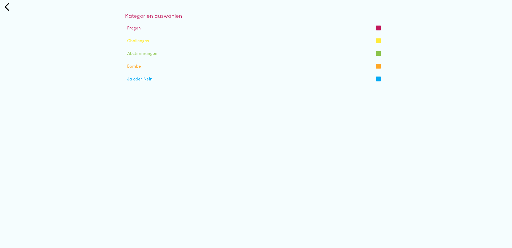
    
Kategorien-Auswählen-Seite: Jeweilige (De-)Aktivierung der verschiedenen Spiele-Kategorien

## Ein neues Spiel starten

Klickt man auf "SPIELEN", so gibt es mehrere Möglichkeiten, was passiert:

- Hat man noch nie ein Spiel gestartet, so landet man direkt auf der Mitspieler-Seite, um ein neues Spiel zu starten und dort einzutragen, wer alles bei diesem mitspielt.
- Hat man bereits ein Spiel gestartet, so landet man auf der Spiele-Auswahl-Seite. Dort kann man entweder ein neues Spiel starten oder das letzte gespielte Spiel beim alten Stand fortsetzen.
- Hat man bereits mehrere Spiele gestartet in der Vergangenheit, so landet man auf der Spiele-Auswahl-Seite. Zusätzlich zu den oben genannten Möglichkeiten kann man sich auch eine verständliche Liste der alten Spiele anzeigen lassen (Alte-Spiele-Seite) und diese alten Spielstände fortführen oder löschen.
 
Einen alten Spielstand fortzusetzen, bedeutet, dass
- schon gespielte Fragen, Challenges, Abstimmungen und Bomben nicht nochmal kommen,
- und die Spielerliste und die damals aktivierten Kategorien des alten Spiels übernommen werden.

Anmerkung: Die Liste aktiver Mitspieler kann jederzeit im Spiel selbst verändert werden.

    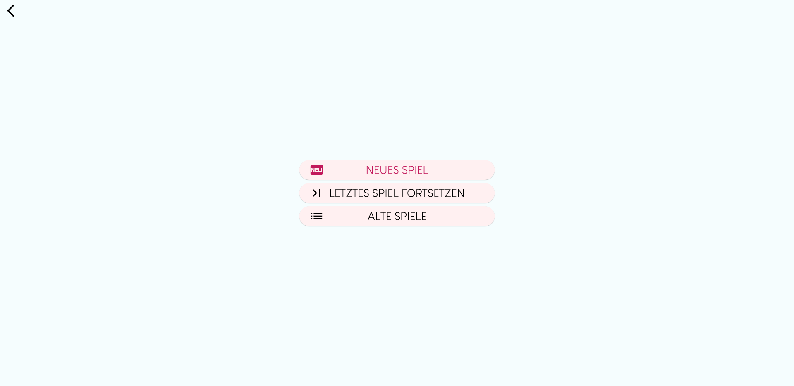
    
Spiele-Auswahl-Seite

    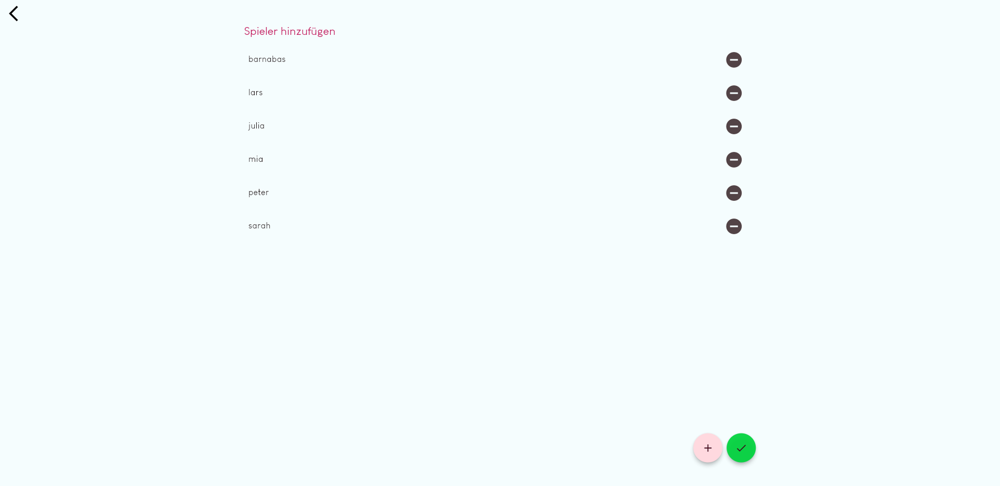
    
Mitspieler-Seite

    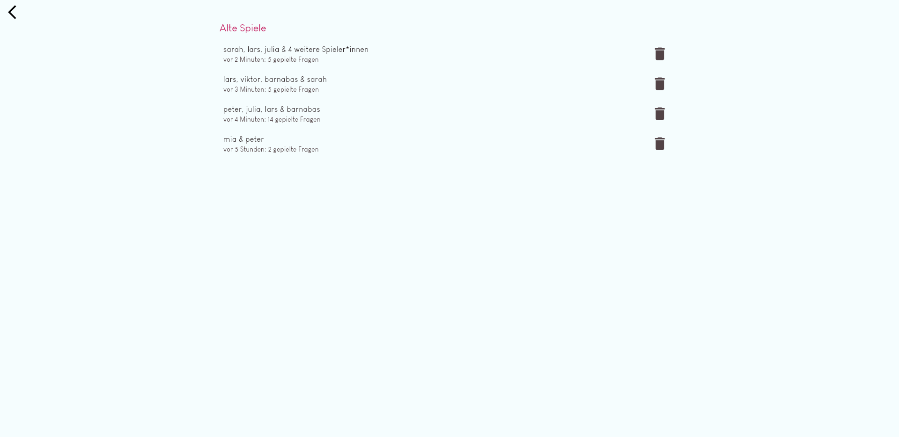
    
Alte Spiele Liste

## Das Spiel läuft - Bilder-Beispiele zu den einzelnen Kategorien

### Frage

    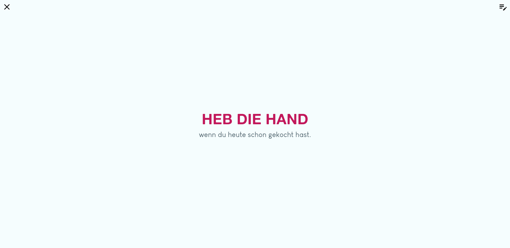

### Challenge

    
    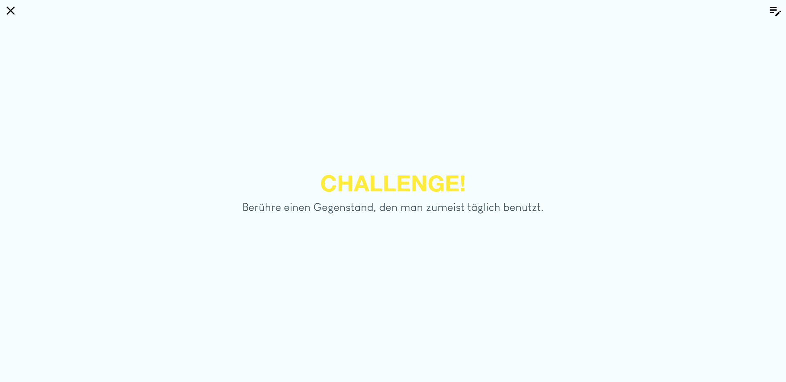

### Abstimmung

    
    

### Bombe

    
    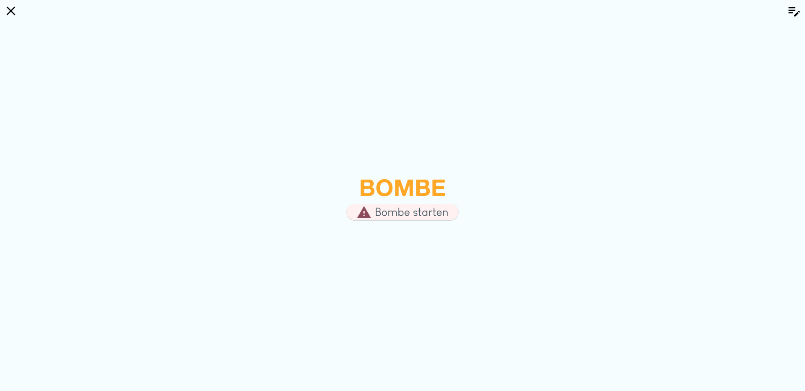
    

### Ja oder Nein

    
    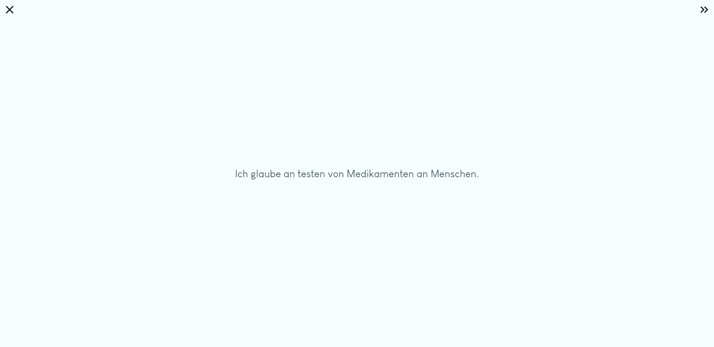
    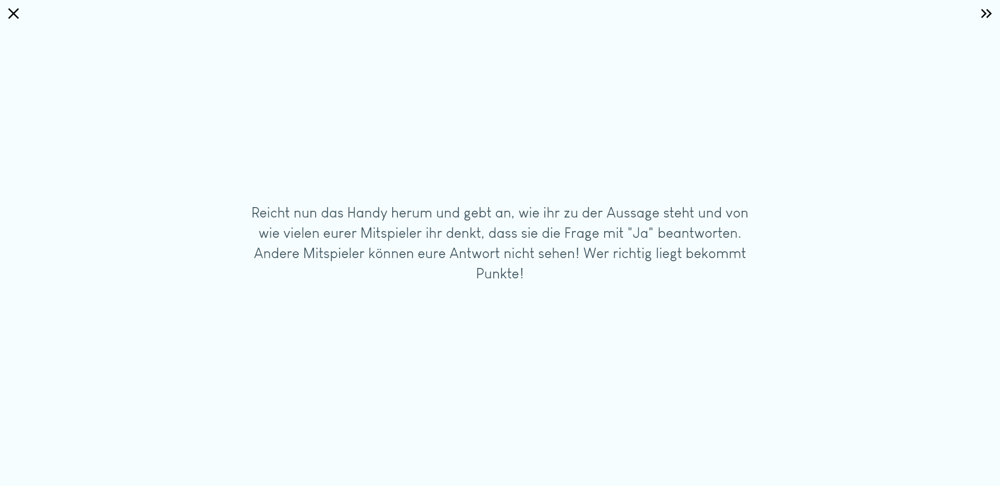
    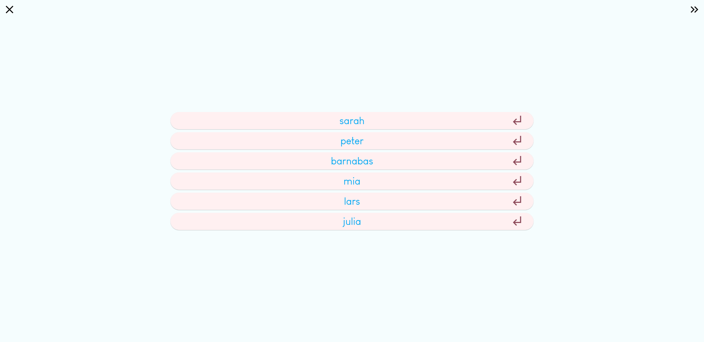
    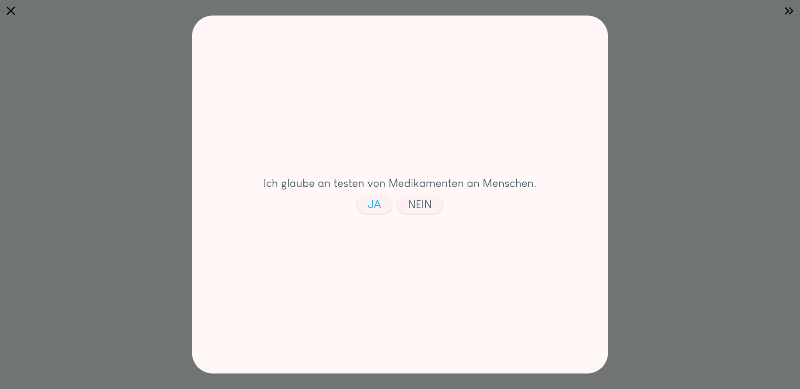
    
    
    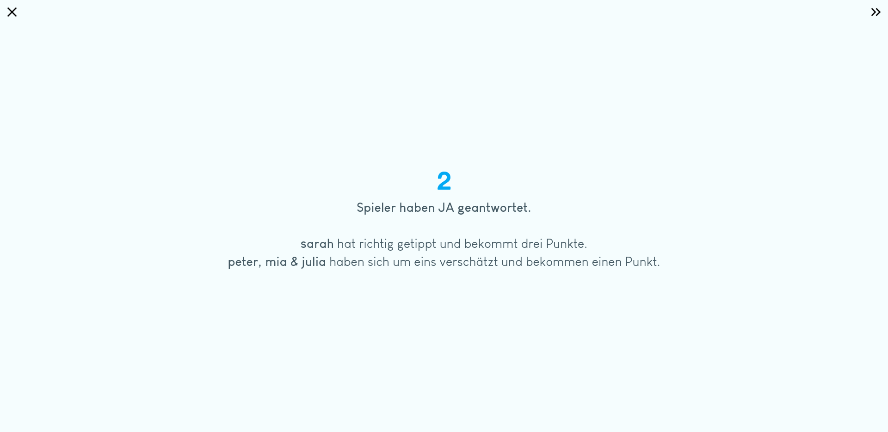

